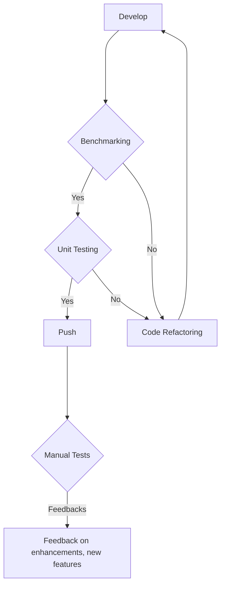
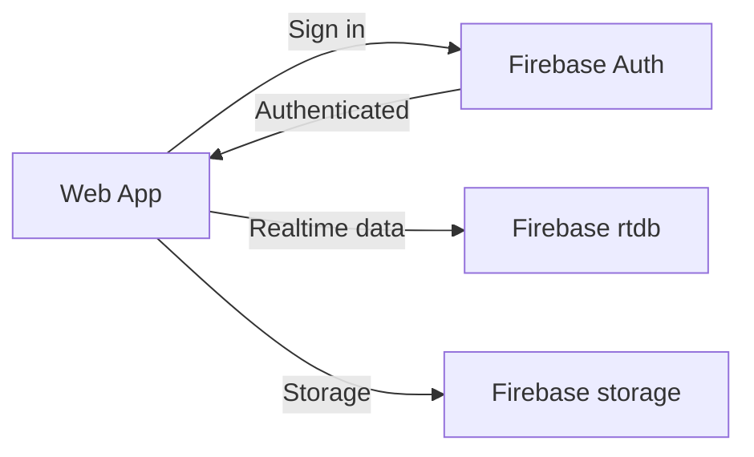
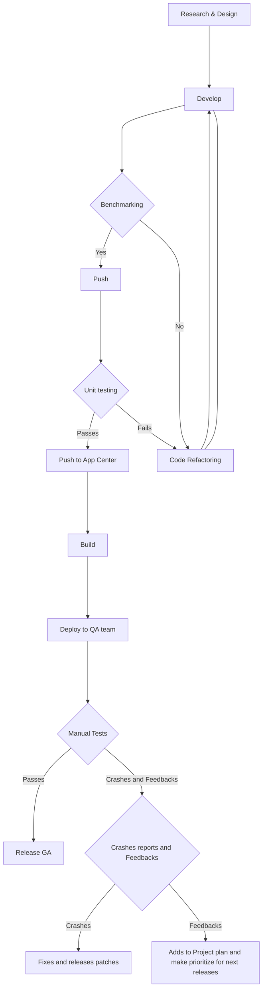
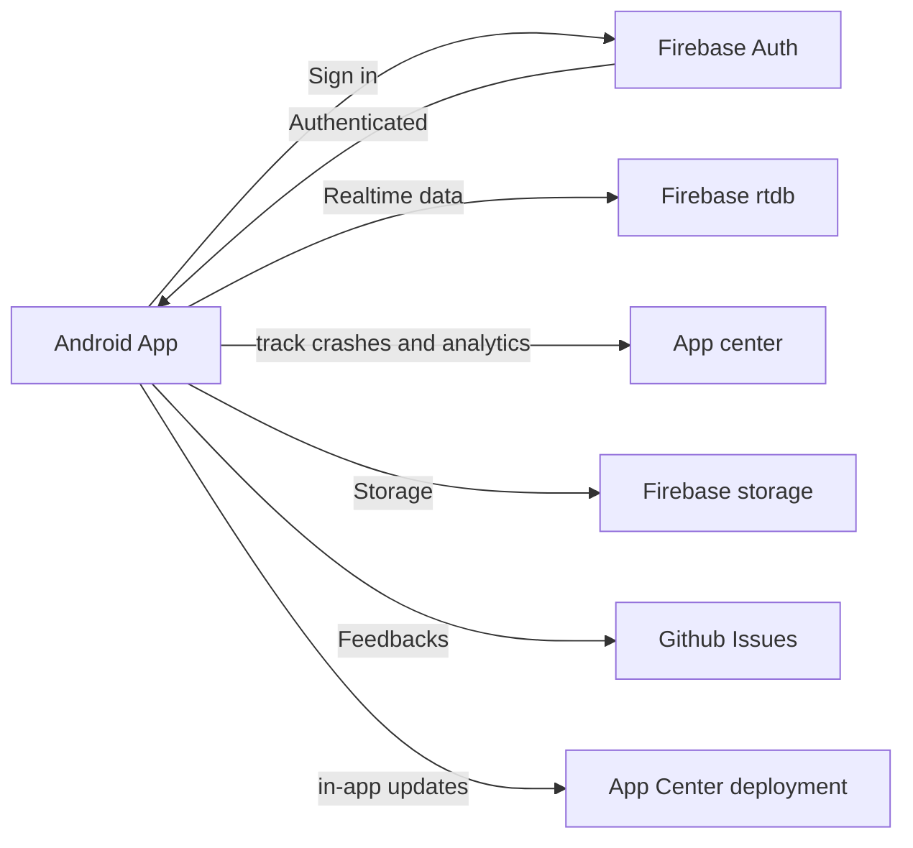
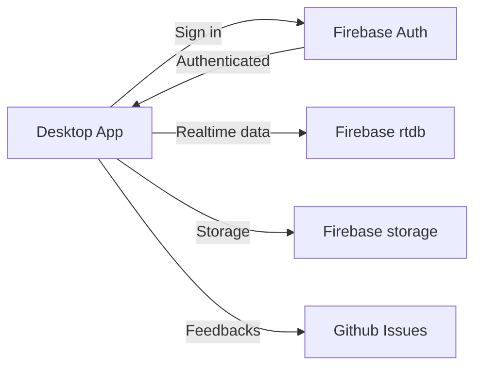

# Documentation
## Open Source Culture in our team
- Our project is open source, every commit and new changes is discussed with broad open source communities from .NET, Firebase, C#, and more
- We have discussed problems and have found best ways to solve it.

## Transparency
- From designing to development and maintainance, every part of the system was transparent and public.

## Accessibility
- We have developed multiple themes to enable accessibility in our app
- We have fontsizes in our app, that low-seeing people can use the app with ease by increasing the overall fontsizes in the app.
- Our app is in three languages (Pashto, Dari, English)

## Apps
- [Web](#Web)
- [Android](#Android)
- [Desktop](#Desktop)

### Web

#### Technologies
- Languages: C# 10, Javascript, HTML, CSS
- Framework: .NET Blazor, PWA
- Libraries: Chart.js
- Backend: Firebase rtdb
- APIs: REST Apis
- Tools: Firebase Emulator suite, Github Actions, Github, VSCode

#### DevOps

#### System Design
> Web App components

### Android

#### Technologies
- Language: C# 8, HTML, CSS
- Framework: Xamarin.Forms
- Libraries: Xamarin Community Toolkit
- Backend: Firebase rtdb, Firebase Authentication, Firebase storage
- APIs: REST Apis
- Tools: Firebase Emulator suite, Github Actions, Github, App Center, Analytics, Visual Studio

#### DevOps

#### Hints
- Research & Design
> Before starting development, we researched on each topic, and we have compared different tools, libraries and frameworks for our solution. and then we document the research and the go to the next phase, Develop.  
- Develop
> developing in technologies
- Benchmarking
> We see the performance of the codes and finding bottlenecks in our code. and sometimes we compares different libraries to improve/enhance the performance of our apps. 
> Here we have an example of serialization libraries, we have used Newtonsoft.json but then we comapre it to find a better solution because we are using firebase a nosql database and we need serialization in almost every part of our app. So we have choose three libraries `Stacktrace.Text`, `Newtonsoft.json`, `System.Text` and we found these numbers so we choose to drop newtonsoft.json and replace it with System.Text. because it works best in our scenarios.
> See the numbers we have got from Serializing an Object of 1000000 objects.  

  
- Code refactoring
> We have put Code refactoring in the center of our process, We refactors code if it doesn't meet our performance requirements, fails our unit tests, or looks messy.
Not only we refactor code for the above issues sometimes we refactor it to
1: Apply design patterns in our code
2: Design principles

- Unit Testing
> We want to make sure that our new feature is not breaking anything. So we test our code repeatedly after each push on Github and App Center

- Deploying to QA team
> QA team is the center of testing process. We wanna make sure the users recieve the new features without any problem or struggle. So our QA team manualy tests it. If there was a crash it automaticaly reports to App center. and if there is a feature to be added, something to be removed, or something need enhancements the QA team is responsible to feedback on that. They don't need to go out of the app, they can give feedback inside the app, Our github app bot is creating an issue for that feedback in github. In we schedule it to our next meeting. If the issue meets our rules so we start developing it.  

- Feedback and Crash report
> We have a central feedback and crash reports system to analysis and document new features, enhancements and bugs to resolve.

#### System Design
> Android App components

### Desktop

#### Technologies

- Languages: C# 10, Javascript, HTML, CSS
- Framework: .NET MAUI, WinUI3
- Libraries: Chart.js
- Frontend UI Framework: Fluent Design
- Backend: Firebase rtdb, Firebase Authentication, Firebase storage
- APIs: REST Apis
- Tools: Firebase Emulator suite, Github Actions, Github, Visual Studio

#### DevOps

#### System Design
> Desktop App components

