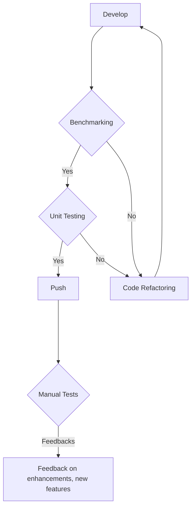
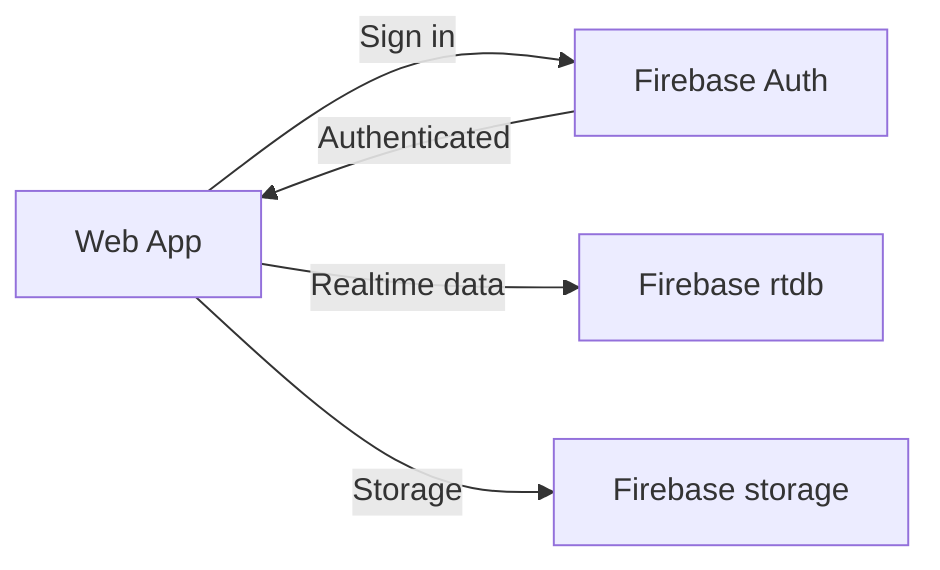
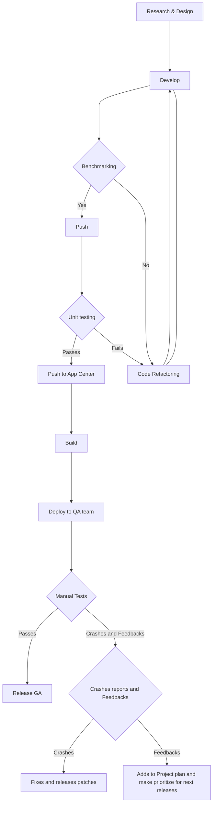
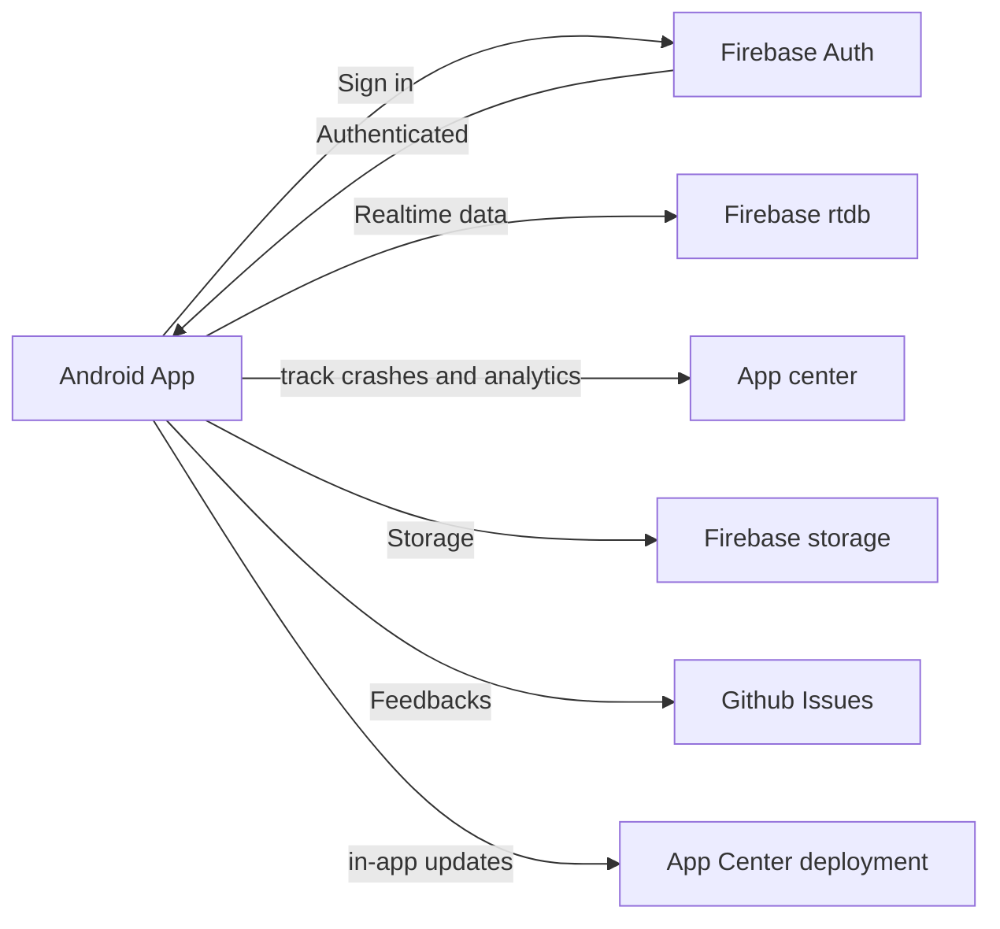
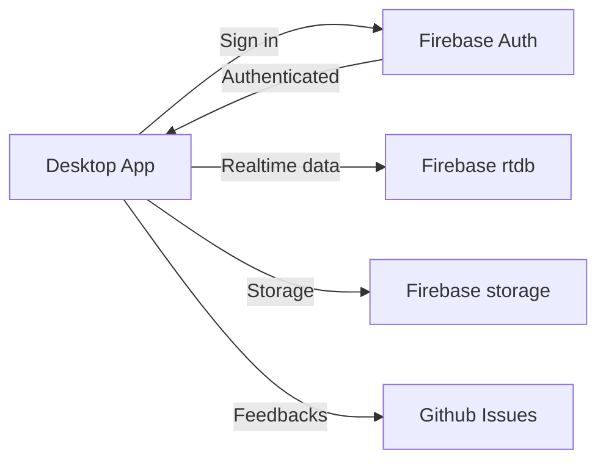
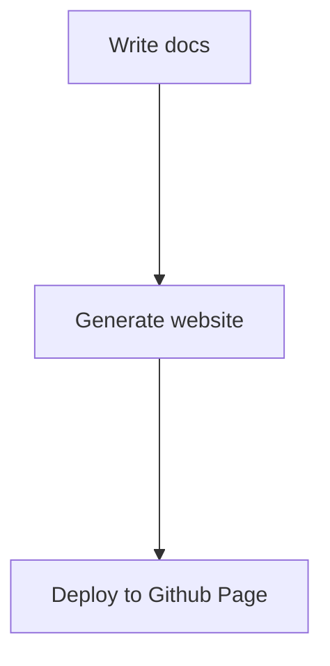

# Documentation
## The Nature of Open Source in our Team Project
- Our project is open source, every commit and changes are discussed with broad open source communities including: .NET, Firebase, C# etc.
- The bugs were discussed and found effective solutions.

## Transparency
- From designing to project development and maintainance, each part of the system is transparent and public.

## Accessibility
- developed multiple themes to enable accessibility in the App.
- The Font size feature, helps increasing the overall font size of the app for those having vision problems.
- The App supports three languages (English, Pashto, Dari).

## Apps
- [Web](#Web)
- [Android](#Android)
- [Desktop](#Desktop)
- [VaccineDocs](#VaccineDocs)

### Web
#### Technologies
- Languages: C# 10, Javascript, HTML, CSS
- Framework: .NET Blazor, PWA
- Libraries: Chart.js
- Backend: Firebase rtdb
- APIs: REST Apis
- Tools: Firebase Emulator suite, Github Actions, Github, VSCode

#### DevOps

#### System Design
> Web App components

### Android

#### Technologies
- Language: C# 8, HTML, CSS
- Framework: Xamarin.Forms
- Libraries: Xamarin Community Toolkit
- Backend: Firebase rtdb, Firebase Authentication, Firebase storage
- APIs: REST Apis
- Tools: Firebase Emulator suite, Github Actions, Github, App Center, Analytics, Visual Studio

#### DevOps

#### Important 
- Research & Design
> Before the starting of Development Phase, Literature review were done, comparing different tools, libraries and frameworks for the best Solution.    
- Development phase
> Developing the Technologies set for project.
- Benchmarking
> Checking the performance of the code and finding bottlenecks, and comparing different libraries to improve/enhance the performance of the App. 
> Serilization is needed almost in each part of the App. The Newtonsoft.json were used and than compared for better solution due to use of Firebase and NoSQL database. Three libraries were used including: `Stacktrace.Text`, `Newtonsoft.json`, and `System.Text`. The following numbers were found for adding and repacing Newtonsoft.json to System.Text.  
> Check the numbers we got from Serializing an Object of 1000000 objects.  

  
- Code refactoring
> Code Refacoring is set in the center of the app processes. Code is refactored, if it doesn't meet the performance requirements, failed unit tests, or not suitable.
Code is not only refactored for above issues sometimes we refactor it to:
1: Apply design patterns in the code
2: Design principles

- Unit Testing
> for checking that the new features added is not have breaking changes in the program , Unit testing is done. The code is tested repeatedly after each push on Github and App Center

- Deploying to QA team
> QA team is the center of testing process. making it sure that users recieve the new features without ecountering any problem.QA team manualy tests it. in case of crashes, it automaticaly report it to App center. if there is a feature to be added, something to be removed, or something need enhancements, the QA team is responsible for the feedback.  github app bot is creating an issue for the feedbacks in github. 

- Feedback and Crash report
> We have a central feedback and crash reports system for analysis and document new features, enhancements and bugs to resolve it.

#### System Design
> Android App components

### Desktop

#### Technologies

- Languages: C# 10, Javascript, HTML, CSS
- Framework: .NET MAUI, WinUI3
- Libraries: Chart.js
- Frontend UI Framework: Fluent Design
- Backend: Firebase rtdb, Firebase Authentication, Firebase storage
- APIs: REST Apis
- Tools: Firebase Emulator suite, Github Actions, Github, Visual Studio

#### DevOps

#### System Design
> Desktop App components

### VaccineDocs

#### Technologies

- Languages: Markdown, CSS, HTML, Javascript
- Framework: DocFx

#### DevOps

